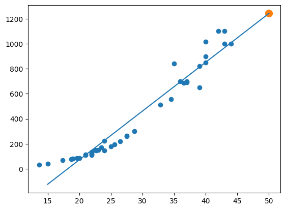

# 3. 회귀 알고리즘과 모델 규제
## 📌 3.1 k-최근접 이웃 회귀

>### 개념:
    1) k-최근접 분류: 예측하려는 샘플에 가까운 샘플 k개 선택 후 다수 클래스를 새로운 샘플의 클래스로 예측
    2) k-최근접 회귀: 예측하려는 샘플에 가까운 샘플 k개 선택후 그들의 평균으로 예측

>### 실습
```python
perch_length = np.array([8.4, 13.7, 15.0, 16.2, 17.4, 18.0, 18.7, 19.0, 19.6, 20.0, 21.0,
       21.0, 21.0, 21.3, 22.0, 22.0, 22.0, 22.0, 22.0, 22.5, 22.5, 22.7,
       23.0, 23.5, 24.0, 24.0, 24.6, 25.0, 25.6, 26.5, 27.3, 27.5, 27.5,
       27.5, 28.0, 28.7, 30.0, 32.8, 34.5, 35.0, 36.5, 36.0, 37.0, 37.0,
       39.0, 39.0, 39.0, 40.0, 40.0, 40.0, 40.0, 42.0, 43.0, 43.0, 43.5,
       44.0])
perch_weight = np.array([5.9, 32.0, 40.0, 51.5, 70.0, 100.0, 78.0, 80.0, 85.0, 85.0, 110.0,
       115.0, 125.0, 130.0, 120.0, 120.0, 130.0, 135.0, 110.0, 130.0,
       150.0, 145.0, 150.0, 170.0, 225.0, 145.0, 188.0, 180.0, 197.0,
       218.0, 300.0, 260.0, 265.0, 250.0, 250.0, 300.0, 320.0, 514.0,
       556.0, 840.0, 685.0, 700.0, 700.0, 690.0, 900.0, 650.0, 820.0,
       850.0, 900.0, 1015.0, 820.0, 1100.0, 1000.0, 1100.0, 1000.0,
       1000.0])
from sklearn.model_selection import train_test_split
train_input, test_input, train_target, test_target = train_test_split(perch_length, perch_weight, random_state=42)  
```
* sklearn의 훈련세트는 2차원 배열이어야 하므로 reshape 해야한다(현재는 1차원 튜플(3,)이므로 (3,1)로 변환 **reshape(-1,1)**
```
train_input = train_input.reshape(-1,1) # -1 : 크기에 -1을 지정하면 나머지 원소개수로 모두 채우라는 의미, 꿀팁!!
test_input = test_input.reshape(-1,1)
print(train_input.shape, test_input.shape)
```
* fitting
```
from sklearn.neighbors import KNeighborsRegressor
knr = KNeighborsRegressor() # n_neighbors 기본값 = 5
knr.fit(train_input, train_target) 
print(knr.score(test_input,test_target)) # R^2값임
```
* mae
```
from sklearn.metrics import mean_absolute_error
pred = knr.predict(test_input)
mae = mean_absolute_error(test_target,pred)
print(mae)
```
* 과대, 과소적합 : train 점수가 test 보다 낮음 -> 과소적합, 데이터 사이즈가 적어서 그럴 확률 높음
    * n_neightrs를 줄여서 해결
```
knr.n_neighbors = 3
knr.fit(train_input, train_target)
print(knr.score(train_input, train_target))
```

## 📌 3.2 Linear Regression
>### KNN 회귀의 한계
1. 주변 값들을 평균 낸게 KNN Reg
2. 그래서 새로운 샘플이 훈련 세트 범위를 벗어나면 엉뚱한 값(가장 가까운 값들의 평균)을 예측함

>### 단순선형회귀
```
from sklearn.linear_model import LinearRegression
lr = LinearRegression()
lr.fit(train_input, train_target)
print(lr.predict([[50]]))
```

>### 다항회귀
* 도미 데이터는 곡선 형태라 직선으로 예측하면 예측력이 떨어짐 -> 다항 회귀(2차식)으로 해결!
* np.column_stack() 함수 사용해 제곱한 값을 앞에 붙임(2열로 만듬)

```
train_poly = np.column_stack((train_input**2, train_input))
test_poly = np.column_stack((test_input**2, test_input))
```
* fitting
```
lr.fit(train_poly, train_target)
print(lr.predict([[50**2, 50]]))
```
* 시각화
```
point = np.arange(15,50)
plt.scatter(train_input, train_target)
plt.plot(point, 1.01*point**2 - 21.6*point + 116.05)
plt.scatter(50,1574,s=100)

plt.scatter(50, 1574, marker='^')
plt.show()
```
.png)

## 📌 3.3 특성공학과 규제

>### 특성공학
* 특성공학(feature engineering) : 기존의 변수를 사용해 새로운 변수를 뽑아내느 작업
* 다중회귀: 여러개 독립변수 사용 -> n차원을 학습

>### 사이킷런의 변환기
* fit(), transform() 메서드 제공
    * 훈련 세트에서는 fit_transform() 메서드 사용
    * 테스트 세트에서는 transform()만 사용해야함!
* PolynomialFeatures() 변환기
    * degree=n을 사용해 n제곱항까지 넣을 수 있음, n이 커질수록 변수가 많아짐(n, n-1...1차항까지)
```
# 5제곱항까지 넣기 by degree 
poly = PolynomialFeatures(degree=5, include_bias=False)
poly.fit(train_input)
train_poly = poly.transform(train_input)
test_poly = poly.transform(test_input)
print(train_poly.shape) # 만들어진 변수가 55개..!!
```
**-> n이 너무 커서 과대적합 문제 발생함**

>### 규제: 과적합 방지해 일반화된 성능 보장
* 기본 회귀 손실함수 
$$ \text{일반 선형 회귀:} \quad \mathcal{L}(\boldsymbol{w}) = \sum_{i=1}^{n} \left( y_i - \boldsymbol{x}_i^\top \boldsymbol{w} \right)^2 $$
* 릿지 회귀(from sklearn.linear_model import Ridge) : L2 규제 사용
    * alpha : 규제 강도 -> 커질수록 과소적합 유도
$$ \text{릿지 회귀 (Ridge Regression):} \quad \mathcal{L}_{\text{Ridge}}(\boldsymbol{w}) = \sum_{i=1}^{n} \left( y_i - \boldsymbol{x}_i^\top \boldsymbol{w} \right)^2 + \lambda \|\boldsymbol{w}\|_2^2 $$

    가중치들이 커지는 걸 벌점 줌 (특히 큰 값일수록 더 크게 벌점)

    계수들을 전체적으로 부드럽게 줄임(shrinkage) → 하지만 대부분 0이 되지는 않음
    왜냐하면 미분했을 때 제곱항은 항상 연속적이므로
* 라쏘회귀 : L1 규제 사용
$$ \text{라쏘 회귀 (Lasso Regression):} \quad \mathcal{L}_{\text{Lasso}}(\boldsymbol{w}) = \sum_{i=1}^{n} \left( y_i - \boldsymbol{x}_i^\top \boldsymbol{w} \right)^2 + \lambda \|\boldsymbol{w}\|_1 $$ 
    미분시 불연속 점 존재 -> 0이됨
    일부 변수를 0으로 만들어 변수 선택하게 함

| 항목         | 릿지 회귀 (L2)         | 라쏘 회귀 (L1)              |      |    |
| ---------- | ------------------ | ----------------------- | ---- | -- |
| 규제항        | \$\sum w\_j^2\$    | \$\sum                  | w\_j | \$ |
| 목적         | 계수 크기 줄이기          | 계수 선택 및 크기 줄이기          |      |    |
| 계수에 미치는 영향 | 모든 계수를 조금씩 줄임      | 일부 계수는 0으로 만들어 버림       |      |    |
| 해석적 특징     | 부드러운 축소(shrinkage) | 희소성(sparsity), 변수 선택 가능 |      |    |
| 최적화 특징     | 원형 제약 (부드럽게 수렴)    | 모서리 제약 (0에서 꺾이는 지점 유도)  |      |    |

# 4. 다양한 분류 알고리즘
## 📌3.1 로지스틱 회귀
* 시그모이드 ftn


$$ \sigma(z) = \frac{1}{1 + e^{-z}} $$ 
$z = \boldsymbol{x}^\top \boldsymbol{w}$ 또는 $z = w_0 + w_1 x_1 + \cdots + w_p x_p$

이 시그모이드 함수는 출력값을 $0$과 $1$ 사이로 매핑해서 확률처럼 해석할 수 있게 해줌
