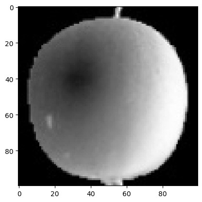
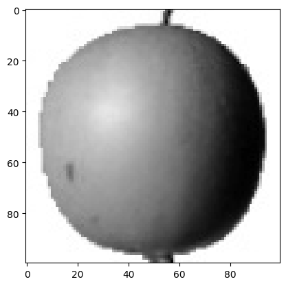
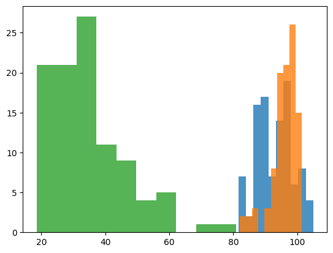
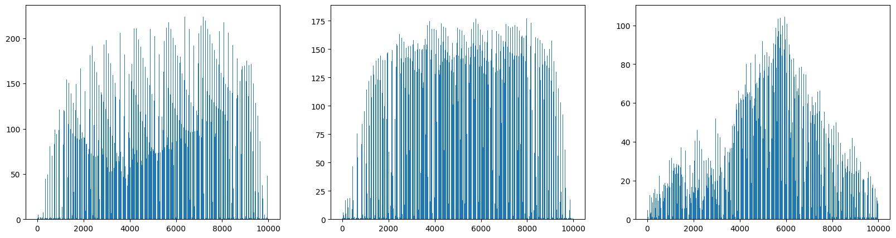
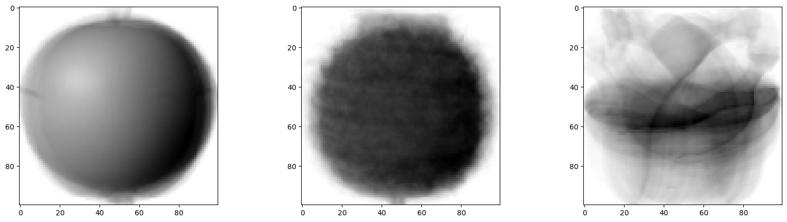
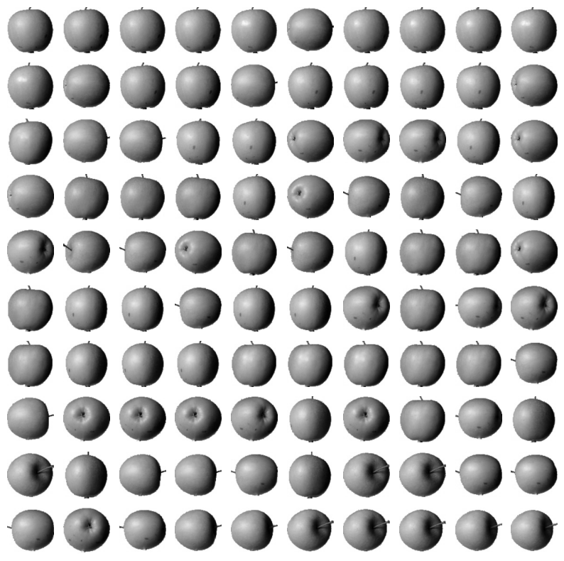
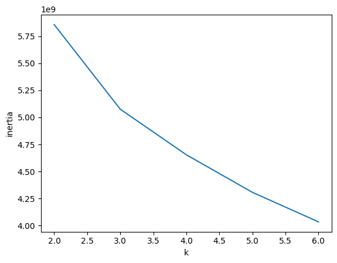

# 6. 비지도 학습

## 📌 군집 알고리즘

* 비지도학습 : 타겟이 없을때 분류하는 머신러닝 알고리즘

>### 과일 데이터
* (300,100,100) 크기 = 300개의 샘플, 100*100크기의 이미지, 100씩 사과, 파인애플, 바나나
* 맷플롯립의 imshow() 함수를 통해 넘파이 배열로 저장된 이미지를 그릴 수 있음
    * 흑백이므로(컬러는 4차원 텐서) cmap 매개변수를 gray

```python
plt.imshow(fruits[0], cmap='gray') # 밝은 부분은 255(숫자)에 가까움 -> 실제와는 괴리가 있음 -> gray_r 
plt.show()
```


```python
plt.imshow(fruits[0], cmap='gray_r')
plt.show()
```


>### 픽셀값 분석하기
* 넘파이 배열을 나눌 때 100*100 이미지를 10000인 1차원 배열로 만들기 for 계산
1) 과일이 각 100개씩 있으므로 100개씩 슬라이싱
2) 슬라이싱을 통해 2, 3차원을 10000으로 합침

```python
apple = fruits[:100].reshape(-1, 100*100)
pineapple = fruits[100:200].reshape(-1, 100*100)
banana = fruits[200:].reshape(-1, 100*100)
```
* 각 과일의 픽셀 평균값 계산하기
    * axis = 0 : 행을 따라 계산(하나의 열에대해 계산)
    * axis =1 : 열 따라 계싼(하나의 행에 대해 계산)
    * 우리가 필요한건 샘플의 평균값, 우리는 샘플을 가로로 나열(1* 10000)했으므로 행기준 계산이 필요

```python
# axis =1 로 하나의 행에 대해 픽셀값 평균 계산
print(apple.mean(axis=1))
```

```python
# 히스토그램
plt.hist(np.mean(apple, axis=1),alpha = 0.8)
plt.hist(np.mean(pineapple, axis=1), alpha = 0.8)
plt.hist(np.mean(banana, axis=1), alpha = 0.8)
```


✅ 바나나는 낮은 필셀값, 사과와 파인애플은 픽셀값만으로 구분하기 쉽지 않음
* why?: 파인애플과 사과는 사진이 크고 동그랗기 때문. 바나나는 사진이 작고 길쭉한 차이
* 해결 방법 : 샘플의 평균값이 아니
라 픽셀별 평균값 = 전체 샘플에 대해 각 픽셀(0~9999)의 평균값 => axis = 0 으로 지정하면 됨

```python
# 전체 샘플에 대해 각 픽셀별 평균값 비교
fix, axes = plt.subplots(1,3,figsize=(20,5))
axes[0].bar(range(10000), np.mean(apple, axis=0))
axes[1].bar(range(10000), np.mean(pineapple, axis=0))
axes[2].bar(range(10000), np.mean(banana, axis=0))
```


 ✅ 과일마다 높은 구간이 다름, 바나나는 확실히 중앙의 픽셀값이 높음

 * 픽셀의 평균값읓 100*100 크기로 바꾸어 이미지로 출력
 ```python
 apple_mean = np.mean(apple, axis=0).reshape(100,100)
pineapple_mean = np.mean(pineapple, axis=0).reshape(100,100)
banana_mean = np.mean(banana, axis=0).reshape(100,100)
fig, axes = plt.subplots(1,3,figsize=(20,5))
axes[0].imshow(apple_mean, cmap='gray_r')
axes[1].imshow(pineapple_mean, cmap='gray_r')
axes[2].imshow(banana_mean, cmap='gray_r')
plt.show()
```


>### 평균값과 가까운 사진 고르기
* 사과 사진의 평균값인 apple_mean(100*100 array)과 가장 가까운 사진 고르기 by abs() 함수
```python
abs_diff = np.abs(fruits - apple_mean)
abs_mean = np.mean(abs_diff, axis=(1,2))
print(abs_mean.shape) # 300개 사진에 대해 사과 평균과 차이이므로 (300,)인 1차원 배열
```

* 이 값이 가장 작은 순서대로 100개 고르기  = 가장 비슷한 사진 100개 고르기
    * np.argsort() 작은것에서 큰 순서대로 나열한 인덱스 반환
```python
apple_index =  np.argsort(abs_mean)[:100]
fig, axes = plt.subplots(10,10,figsize=(10,10)) # subplot 100개 생성
for i in range(10): # 행
  for j in range(10): # 열
    axes[i,j].imshow(fruits[apple_index[i*10+j]],cmap = 'gray_r')
    axes[i,j].axis('off') # axis('off') 깔끔하게 그리기 위해 좌표축 그리지 않음
plt.show()
```


>### 실제 비지도 학습
: 실제로는 타깃값을 모르기 때문에 데이터에 있는 패턴을 찾아야함
* 군집 : 비슷한 샘플끼리 그룹으로 모으는 작업
* 다음절에서는 타깃이 없는 사진 사용할것

## 📌 k-means clustering

>### intro
* 앞의 예시에선 사과, 파인, 바나나 사진임을 이미 알고 있었음. 하지만 진짜 비지도 학습에서는 어떤 과일이 있는지 모름 => k-means 알고리즘 사용

* k-means : 평균값이 클러스터 중심에 위치

>### K-Means 알고리즘 소개
1) 무작위로 k개 클러스터 중심 정함
2) 각 샘플에서 가장 가까운 클러스터 중심을 찾아 해당 클러스터에 배정
3) 클러스터에 속한 샘플의 평균값으로 클러스터 중심 변경
4) 클러스터 중심에 변화가 없을 때까지 반복

>### 구현

```python
fruits_2d = fruits.reshape(-1, 100*100)
from sklearn.cluster import KMeans
km = KMeans(n_clusters=3, random_state=42)
km.fit(fruits_2d)
print(km.labels_)
```
* 3개의 클러스터(n_clusters 메서드 사용)
* 군집의 결과는 labels_속성에 저장됨
* 각 레이블마다 몇개가 있는지 확인 : ```print(np.unique(km.labels_, return_counts=True))```
* 각 클러스터가 어떤 그림을 나타냈는지 출력 
    : figsize는 ratio에 비례하여 커짐
    ```python
    def draw_fruits(arr, ratio=1):
        n = len(arr) 
        rows = int(np.ceil(n/10)) # 행 개수
        cols = n if rows<2 else 10
        fig, axs = plt.subplots(rows, cols, figsize=(cols*ratio, rows*ratio), squeeze=False)
        for i in range(rows):
            for j in range(cols):
                if i*10 + j <n:
                    axs[i,j].imshow(arr[i*10+j], cmap='gray_r')
                axs[i,j].axis('off')
        plt.show()
    ```
    * 레이블 0(클러스터 1) 사진 출력 by ```km.labels_ == 0```
    
    ```python
    draw_fruits(fruits[km.labels_==0])
    ```

-> 완벽하게 구별하진 못하지만 그래도 스스로 비슷한 샘플을 잘 모음
>### 클러스터 중심
* 최종 클러스터의 중심은 ```cluster_centers_``` 속성에 저장됨
```python
draw_fruits(km.cluster_centers_.reshape(-1, 100, 100), ratio=3)
```
* 가장 가까운 클러스터로 예측 by predict()
```python
print(km.predict(fruits_2d[100:101]))
```

>### 최적의 k 찾기
✅ **엘보우 method**
: 클러스터 중심과 샘플의 거리의 제곱합 = 이니셔라고 정의
* 일반적으로 클러스터가 늘어나면 이니셔가 줄어듬
* 이때 클러스터 개수를 증가시키면서 이니셔를 그래프로 그리면 감소하는 속도가 꺽이는 지점 존재 => 이 지점부터 클러ㅗ스터에 잘 밀집된 정도가 개선되지 않음 = 

* ```inertia_``` 사용하여 계산
    * k를 2~6까지 변화시키면서 kmeans 5번 훈련
```python
inertia = []
for k in range(2,7):
  km = KMeans(n_clusters=k, random_state=42)
  km.fit(fruits_2d)
  inertia.append(km.inertia_)
plt.plot(range(2,7), inertia)
plt.xlabel('k')
plt.ylabel('inertia')
plt.show()
```

-> k = 3 결정!

## 주성분 분석

>### 차원과 차원 축소
* 차원 : (= 특성), 과일 사진의 경우 10,000개의 픽셀이 있기 때문에 10000개의 특성이 있음. 
    * n차원 배열의 경우 n(축의 갯수)가 차원
    * 1차원의 경우 벡터이므로 원소의 개수
> 차원(특성)이 많아지면 과적합될 가능성 높음 -> 데이터를 가장 잘 나타내는 일부 특성 선택 = 차원 축소

>### PCA
* 주성분 분석을 통해 차원을 축소하는 비지도 학습
* 주성분 벡터
    * 개념 : 
    1) 제1 주성분 : 분산이 가장 큰 방향의 벡터, 분산 = 정보량으로 이해 가능
    2) 제2 주성분 : 21주성분의 수직이고 분산이 가장 큰 다음 벡터
    3) 전체 주성분의 갯수는 원본 차원의 수와 같다

**📌 주성분은 원본 차원과 같고 주성분으로 바꾼 데이터는 차원이 줄어든다는게 무슨 뜻?**
``` 
: 주성분의 수는 원본 차원 수와 같을 수 있다.

예: 100차원 데이터 → 100개의 주성분 가능.

하지만 이 중에 정보를 많이 담고 있는 상위 몇 개만 사용해도 충분한 경우가 많아요.

데이터를 주성분으로 표현하면 차원을 줄일 수 있다.

예: 원래 100차원이었지만, 그중 95%의 정보를 담는 상위 10개의 주성분만 사용해서 데이터를 10차원으로 바꿀 수 있어요.
```


```python
from sklearn.decomposition import PCA
pca = PCA(n_components = 50) # n_components : 주성분 개수 지정
pca.fit(fruits_2d)
draw_fruits(pca.components_.reshape(-1,100,100))
```
* pca가 찾은 주성분은 ```components_```속성에 저장됨


위 그림에서 원본 데이터에서 가장 분산이 큰 방향을 순서대로 나타낸 것 = 데이터에서 특징을 잡아낸 것

✅ 주성분을 찾았으므로 특성 개수를 10000개에서 50개로 줄이자 by transform()
```python
# 100000 -> 50으로 차원축소하기
fruits_pca = pca.transform(fruits_2d)
print(fruits_pca.shape)
```

>### 원본데이터 재구성
* pca를 하면 어느정도 정보 손실이 발생할 수 밖에 없음...하지만 이를 재구성할 수 있다
by ```inverse_transform()``` 메서드 사용

```python
# 데이터 재구성
fruits_inverse = pca.inverse_transform(fruits_pca)
print(fruits_inverse.shape)
# 재구성한 데이터 이미지로 복원
fruits_reconstruct = fruits_inverse.reshape(-1,100,100)
for start in [0, 100, 200]:
  draw_fruits(fruits_reconstruct[start:start+100])
  print("\n")
  ```


✅ 거의 모든 과일이 잘 복원된 것을 확인 가능

>### 설명된 분산 
```explained_variance_ratio_```: 각 주성분의 설명된 분산 비율이 기록됨.  
* 당연히 제 1 주성분이 가장 큼
* 이 분산 비율을 모두 더하면 50개 주성분으로 표현하고 있는 총 분산 비율을 얻을 수 있다
```python
# 설명된 분산
print(np.sum(pca.explained_variance_ratio_))
```
**-> 약 92%의 분산이 설명됨. 이는 원본 데이터를 복원했을 때 이미지 품질ㅇ이 높았던 이유**


* 처음 10개의 주성분이 대부분 분산을 표현

>### 다른 알고리즘과 함께 사용하기
* PCA로 차원 축소된 데이터를 사용하여 지도 학습 모델 훈련

> 1️⃣ 로지스틱 회귀 모형 사용(3개의 과일 사진 분류)

1) target 생성 : 리스트와 정수를 곱하면 리스트안 원소를 정수만큼 반복
```python
target = np.array([0]*100 + [1]*100 + [2]*100)
```
2) 교차 검증 수행하여 회귀모델 성능 파악 by cross_validate()
```python
from sklearn.model_selection import cross_validate
scores = cross_validate(lr, fruits_2d, target)
print(np.mean(scores['test_score']), np.mean(scores['fit_time']))
```
* 점수는 0.997로 특성이 10000개나 되기 때문에 300개 샘플에서는 과대적합됨
* 시간은 **1.03**초 걸림

3) pca 사용
```python
scores = cross_validate(lr, fruits_pca, target)
print(np.mean(scores['test_score']), np.mean(scores['fit_time']))
```
* 성능은 유지되었는데 훈련시간은 0.06초로 20배 빨라짐

**📌 분산의 비율을 지정하여 PCA가 설명된 분산의 비율만큼 주성분을 찾도록 만들기**
* 똑같이 n_components 사용하는데 여기서는 비율로 사용
```python
pca = PCA(n_components=0.5)
pca.fit(fruits_2d)
print(pca.n_components_)
```
**-> 2개의 특성만으로 50% 분산이 설명됨**

> 2개의 주성분만 사용해서 로지스틱 회귀 수행
```python
scores = cross_validate(lr, fruits_pca, target)
print(np.mean(scores['test_score']), np.mean(scores['fit_time']))
```
-> 2개의 주성분만 사용해도 99% 정확도!!


> 2️⃣ kmeans 클러스터링

```python
km = KMeans(n_clusters=3, random_state=42)
km.fit(fruits_pca)
print(np.unique(km.labels_, return_counts=True))
```
(array([0, 1, 2], dtype=int32), array([112,  98,  90]))

```python
for label in range(0,3):
  draw_fruits(fruits[km.labels_ == label])
  print("\n")
```


* 클러스터 산점도

    * 각 클러스터별 산점도가 잘 구분됨
    * 사과와 파인애플의 클러스터 경계가 가까워 위의 그림에서 몇개가 혼동을 일으킴
